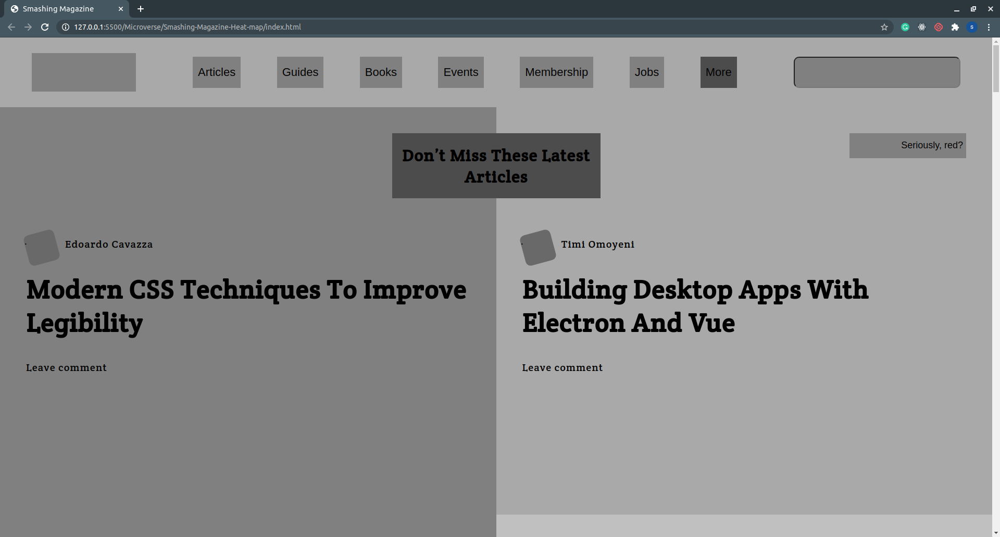

# Smashing-Magazine-Heat-map

> In this project, we create a Heat-mao for Smashing Magazine website.

## Built With

- HTML & CSS3,
- FlexBox, CSS-Grid, Float

## Live Demo

[Live Demo Link](https://raw.githack.com/sanadwj/Smashing-Magazine-Heat-map/feature-branch/index.html)

## Getting Started

To get a local copy up and running follow these simple example steps.

### Prerequisites

- Code Editor
- Web Browser

### Setup

`$git clone https://github.com/sanadwj/Smashing-Magazine-Heat-map.git`

### Install

- Run a local server

### Usage

- Personal Project - The New York Times Clone

## Authors

👤 **Miguel Uzcátegui**

- Github: [@Miguelus373](https://github.com/Miguelus373 )

👤 **Sanad Walid Abujbara**

- Github: [@sanadwj](https://github.com/githubhandle)
- Twitter: [@sandooog](https://twitter.com/sandooog)
- Linkedin: [sanad-abujbara](https://linkedin.com/in/sanad-abujbara)

## 🤝 Contributing

Contributions, issues and feature requests are welcome!

Feel free to check the [issues page](https://github.com/sanadwj/Smashing-Magazine-Heat-map/issues).

## Show your support

Give a ⭐️ if you like this project!

## Acknowledgments

- Microverse Team 140 (The Cupids)
- Microverse Team 139 (The Thanatos)

## 📝 License

This project is [MIT](lic.url) licensed.
